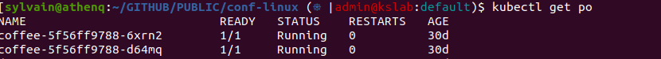

# conf-linux

That's a collection of ansible role to configure my Linux account for a new PC (debian based). That's far away from perfection but that's a start.

## Execution

```bash
# clone the project
git clone git@github.com:sgaunet/conf-linux.git
# Install dependencies
sudo apt install libffi-dev
sudo apt-get install python-dev-is-python3
sudo apt install build-essential
sudo apt install python3-jmespath
# create a python virtual envs
python3 -m venv   venv                                  # create python virutal environment. Do it once
source venv/bin/activate                                # set your virtual environment  (set it always before launch commands on this project)
pip install -r requirements.txt                         # install requirements in your virtual env
ansible-galaxy collection install -r requirements.yml   # install galaxy collections


cd conf-linux/src
<edit> installation.yml
./go.sh
```

## Roles

### kube-ps1

To get a beautiful prompt (for bash or zsh)



### And

* common
    * Install common softwares cifs-utils tmux git git-crypt gpg docker jq unzip
    * Install software-properties-common apt-transport-https wget

For AWS :

* [eksctl](https://eksctl.io/)
* [awscli v2](https://github.com/aws/aws-cli/)
* [ekspodlogs](https://github.com/sgaunet/ekspodlogs)

For kubernetes:

* [krew](https://krew.sigs.k8s.io/)
* [kustomize](https://github.com/kubernetes-sigs/kustomize)
* [helm v3](https://helm.sh/docs/intro/install/)
* [helm-docs](https://github.com/norwoodj/helm-docs)
* [helmfile](https://github.com/helmfile/helmfile)
* [kubectl-dashboard](https://github.com/bouk/kubectl-dashboard)
* [k9s](https://k9scli.io/)
* [kubectl](https://kubernetes.io/releases/download/)
* alias for kubectl (k=kubectl + bash completion/zsh completion)
* [kubectx/kubens](https://github.com/ahmetb/kubectx/)
* [stern](https://github.com/stern/stern)
* [popeye](https://github.com/derailed/popeye)
* [kfilt](https://github.com/ryane/kfilt)
* [kube-capacity](https://github.com/robscott/kube-capacity)
* [kube-linter](https://github.com/stackrox/kube-linter)
* [kconf](https://github.com/particledecay/kconf)
* [kubectl-ice](https://github.com/NimbleArchitect/kubectl-ice)
* [kubefwd](https://github.com/txn2/kubefwd)
* [kubent (kube-no-trouble)](https://github.com/doitintl/kube-no-trouble)
* [kluctl](https://github.com/kluctl/kluctl)
* [kubescape](https://github.com/kubescape/kubescape)
* [kubeshark](https://github.com/kubeshark/kubeshark)
* [kubeval](https://github.com/instrumenta/kubeval)
* [kor](https://github.com/yonahd/kor)
* [helmchart-helper](https://github.com/sgaunet/helmchart-helper)
* [vals](https://github.com/helmfile/vals)
* [kubecm](https://github.com/sunny0826/kubecm)

For markdown :

* [mdtohtml](https://github.com/sgaunet/mdtohtml)

For Docker :

* [hadolint](https://github.com/hadolint/hadolint)
* [docker buildx](https://github.com/docker/buildx)
* [grype](https://github.com/anchore/grype)
* [dive](https://github.com/wagoodman/dive)
* [CLIs of go-containerregistry](https://github.com/google/go-containerregistry)

For GOLANG :

* [goreleaser](https://github.com/goreleaser/goreleaser/)
* [task](https://taskfile.dev/)
* [sqlc](https://sqlc.dev/)
* [golang-ci-lint](https://github.com/golangci/golangci-lint)
* [pre-commit](https://github.com/pre-commit/pre-commit)
* [moq](https://github.com/matryer/moq)


VM :

* [packer](https://www.packer.io/)
* [vagrant](https://www.vagrantup.com/downloads)

Load tests :

* [k6](https://k6.io/)

Development:

* [vscode](https://code.visualstudio.com/docs/setup/linux)
* vscode extensions
* [gitleaks](https://github.com/zricethezav/gitleaks)
* [glab](https://gitlab.com/gitlab-org/cli)
* [jira-cli](https://github.com/ankitpokhrel/jira-cli)
* [gitlab-issue-report](https://github.com/sgaunet/gitlab-issue-report)
* [gitlab-stats](https://github.com/sgaunet/gitlab-stats)
* [gitlab-vars](https://github.com/sgaunet/gitlab-vars) - **beta**
* [gum](https://github.com/charmbracelet/gum)
* [nfpm](https://nfpm.goreleaser.com/)
* [chglog](https://github.com/goreleaser/chglog)
* [trufflehog](https://github.com/trufflesecurity/trufflehog)
* [fx](https://github.com/antonmedv/fx)
* [osv-scanner](https://github.com/google/osv-scanner)
* [fly (concourse)](https://github.com/concourse/concourse)
* [pgweb](https://github.com/sosedoff/pgweb)
* [tbls](https://github.com/k1LoW/tbls)
* [delta](https://github.com/dandavison/delta)
* [act](https://github.com/nektos/act)
* [jwt-cli](https://github.com/sgaunet/jwt-cli)
* [devbox](https://github.com/jetify-com/devbox)

Linux tools :

* [zellij](https://github.com/zellij-org/zellij)
* [gdu](https://github.com/dundee/gdu)
* [yq](https://github.com/mikefarah/yq)
* [bandwhich](https://github.com/imsnif/bandwhich)
* [hyperfine](https://github.com/sharkdp/hyperfine)
* [gocrypt](https://github.com/sgaunet/gocrypt)
* [pet](https://github.com/knqyf263/pet)
* [usql](https://github.com/xo/usql)
* [bat](https://github.com/sharkdp/bat)
* [vivid](https://github.com/sharkdp/vivid)
* [viddy](https://github.com/sachaos/viddy)
* [tealdeer](https://github.com/dbrgn/tealdeer)
* [s5cmd](https://github.com/peak/s5cmd)
* [vhs](https://github.com/charmbracelet/vhs)
* [ttyd](https://github.com/tsl0922/ttyd) - dependency for vhs
* [gini](https://github.com/sgaunet/gini)
* [envtemplate](https://github.com/sgaunet/envtemplate)
* [calcdate](https://github.com/sgaunet/calcdate)
* [gocryptfs](https://github.com/rfjakob/gocryptfs)
* [zenith](https://github.com/bvaisvil/zenith)
* [retry](https://github.com/sgaunet/retry)
* [tspin](https://github.com/bensadeh/tailspin)
* [sshx](https://github.com/ekzhang/sshx)
* [q](https://github.com/natesales/q)
* [eph-beta](https://github.com/ephemeralfiles/eph-beta)
* [freeze](https://github.com/charmbracelet/freeze)
* [lsd]https://github.com/lsd-rs/lsd)
* [eza](https://github.com/eza-community/eza)
* [zoxide](https://github.com/ajeetdsouza/zoxide)
* [termshot](https://github.com/homeport/termshot)

Tests:

* [venom](https://github.com/ovh/venom)
* [muffet](https://github.com/raviqqe/muffet/)

Misceleaneous :

* [peek](https://github.com/phw/peek)
* zsh
* [startship](https://starship.rs/)
* [pastel](https://github.com/sharkdp/pastel)
* [d2](https://github.com/terrastruct/d2)
* [rclone](https://rclone.org/)
* [dasel](https://github.com/TomWright/dasel)

Bash formatter:

* [shellcheck](https://www.shellcheck.net/)
* [shfmt](https://github.com/mvdan/sh)

IAC:

* [terraform](https://developer.hashicorp.com/terraform)

## Auto update roles

```bash
./update-versions.sh
```

But not all roles can be updated with this script. List of roles to update manually:

```bash
./list-no-auto.sh
```
